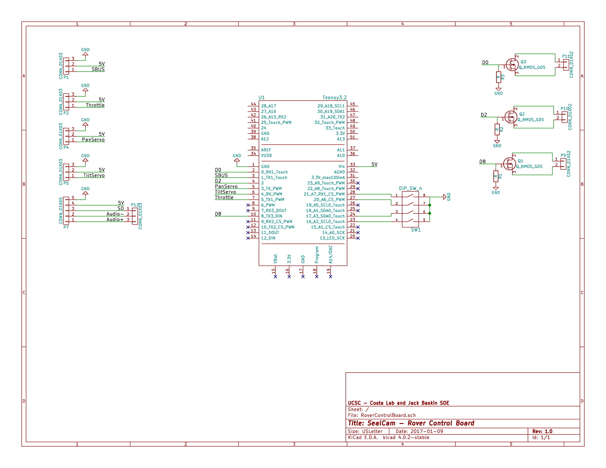

## Rover Control Board

This is the rover control board. It manages the rover systems and receives signals from the controller via a 2.4Ghz RC transmitter over SBUS.

Its main responsibilities are:
 * control camera panning
 * play audio files when requested
 * expandability with additional PWM outputs and switches
 
 Schematic:
 
